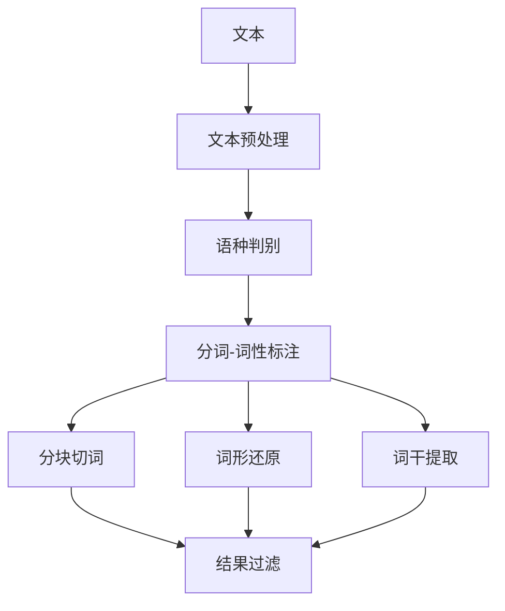

# 英文NLP实践【NLTK】(1)

在**海外舆情监控**项目的契机下，通过不断的遇到问题，再解决问题的过程中，发现了一些好玩的文本处理方法和一些实用的工具。所以写在这里当作分享的同时，也当作是自己的一个备忘录。 由于游戏聊天是一个多语种的环境，针对不同语言的处理逻辑和技巧也不尽相同。今天先总结的是**英文**，后续会陆陆续续更新**中文、日文、韩语**等其他语种。选择的分析工具是`NLTK`（ps：`NLTK`不支持中文），下文中展示的代码例子也是通过`NLTK`来实践的。

- [x] 🧐 **文本挖掘的思路**
- [x] 🛠 **文本预处理**；
- [x] 🚮 **语种判别**；
- [x] 🔪 **分句 & 分词**；
- [x] 🌟 **词性标注**；
- [x] 🔷 **分块切词**；
- [x] 👶 **词形还原 & 词干提取**；
- [x] ⛳️ **过滤提纯**；

## 文本挖掘的思路

在分析之前，应当有意识的维护一套自己的**用户词典**，可以让运营同事提供游戏专业名词，这些词也往往是运营同事比较关注的重点词汇，这些词汇在市面上的分词工具中是比较难准确切割的。同时，寻找合适的*stopwords***停用词词典**，对后续的分词结果再做一层过滤。字典最好有一个**标准化**的格式，后续后新的用途可以灵活的使用。目前我的字典按照下面这个格式进行整理：


整体的分析步骤如下：



## 文本预处理

去除表情和多余的空格，大小写转化等一系列常规操作。

```python
import emoji
import re

def emoji_remove(text):
    text = emoji.demojize(text)
    res = re.sub(':\S+?:', ' ', text)
    return res

def text_clean(text):
    text = re.sub(r"[ ]+", " ", text)
    text = self.emoji_remove(text)
    text = text.strip().lower()
    return text
```

## 语种判别

使用`langid`工具进行语种判别，`langid`支持56种语言识别，和概率输出，整体识别效果还不错，也比较稳定。但是需要注意的是标点符号（半角，全角）会影响判别，所以在判别的时候可以先将标点符号替换成空格。

```python
from langid.langid import LanguageIdentifier, model
identifier = LanguageIdentifier.from_modelstring(model,norm_probs=True)
identifier.classify('我爱你中国')
```

> ('zh', 0.9999998421995415)

## 分句 & 分词

`nltk`默认用`PunktSentenceTokenizer`分句，用基于宾州树库分词规范的`TreebankWordTokenizer`分词。简单对比`nltk.word_tokenize`和`nltk.wordpunct_tokenize`的区别：

* word_tokenize（默认）：
  
  * 缩写(contraction)]()：Isn’t会分成Is和n’t
  * 符号粘连：19+，hello～这种伴有符号的词会默认将他们划分成一个整体
  
* wordpunct_tokenize：
  
  * 缩写(contraction)：Isn’t会分成Isn和t
  * 符号粘连： 19+，hello～这种伴有符号的词会划分成19,+,hello,~


```python
import nltk
print(nltk.word_tokenize("isn't"))
print(nltk.wordpunct_tokenize("isn't"))
print(nltk.word_tokenize('19~'))
print(nltk.wordpunct_tokenize('19~'))
```

> ['is', "n't"]
>
> ['isn', "'", 't']
>
> ['19~']
>
> ['19', '~']

总的来说，`wordpunct_tokenize`的颗粒度更细，但是也容易分错词。	`word_tokenize`除了符号粘连处理不好之外，效果更好。同时`NLTK`工具支持选择指定分词器，可以通过`dir(nltk.tokenize)` 进行选择。


## 附件


## 参考

[自然语言处理工具包之NLTK](https://www.biaodianfu.com/nltk.html)

[ Natural Language Toolkit](https://www.nltk.org)

最新更新于 2021.12.29

